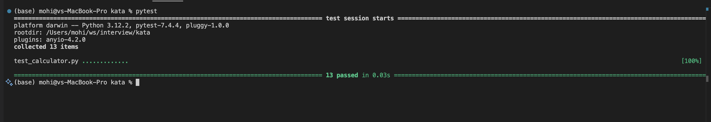

# Kata TDD

## Features

1. Simple String calculator 
2. Allow the add method to handle any amount of numbers
3. Allow the add method to handle new lines between numbers (instead of commas).
4. Support different delimiters
5. Calling add with a negative number will throw an exception: "negative numbers not allowed <negative_number>".
6. Delimiters can be of any length with the following format
7. Allow multiple delimiters

## Results

### Screenshot

